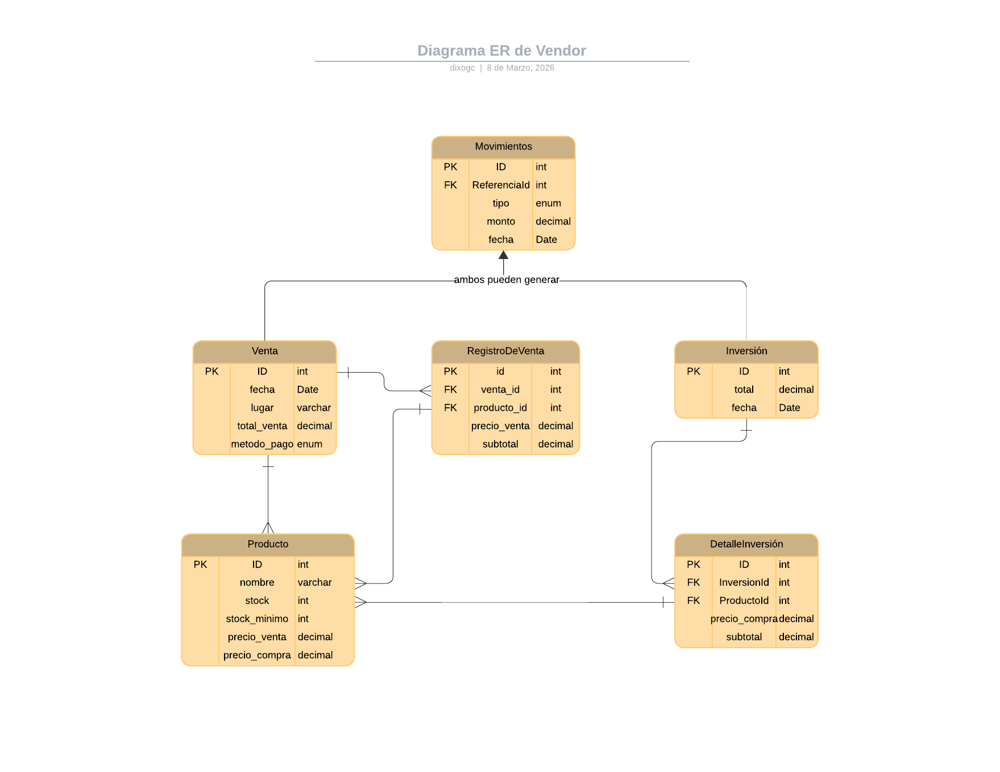

# Vendor
Backend RESTFul para gestión de negocios pequeños de ventas.

## Stack tecnológico
* **Lenguajes:** C#
* **Framework:** Entity Framework
* **Base de Datos:** PostgreSQL(Neon)
* **Contenedores:** Docker
* **Despliegue:** Render

## Arquitectura
El sistema implementa **MVC** añadiendo Repositories y Services para un manejo de lógica más limpio y legible.

## Diagrama ER

